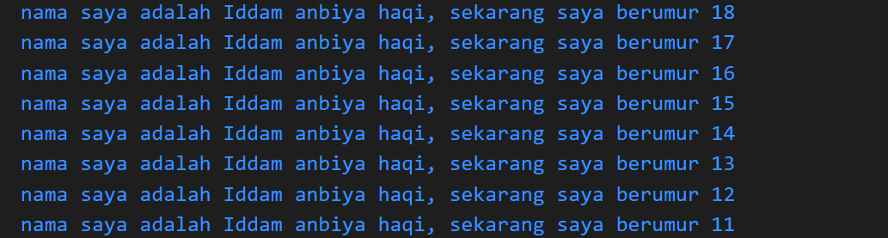

# Pemrograman Mobile - pertemuan #1

<h2>Project "Hello World"<h4>

NIM : 2141720242

Nama : Iddam anbiya haqi

- Hasil Run

 

## soal 2
Mudah mengedit dan mengoreksi hasil coding  secara realtime fitur Hot Reload - Tidak memerlukan kemampuan native

## soal 3
Kode Dart dieksekusi pada lingkungan yang mendukung bahasa Dart.Lingkungan yang mendukung bahasa Dart memperhatikan fitur-fitur seperti berikut: Runtime systems, Dart core libraries,Garbage collectors

Kompilasi JIT adalah tempat kode sumber dikompilasi sesuai kebutuhan-Just in time Dart memuat dan mengkompilasi kode ke kode mesin asli (native).

Kompilasi AOT VM bekerja lebih seperti sistem runtime Dart, yang menyediakan garbage collector dan metode metode native  dari software development kit(SDK) pada aplikasi.